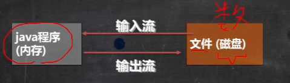

[toc]

# Java IO流

## 文件

### 什么是文件

**在编程的概念中， 文件就是保存数据的地方**

### 文件流

文件在程序中是以流的形式来操作的

流：数据在数据源 ( 文件 )  和程序 ( 文件 ) 之间经历的路径

输入流：数据从数据源 ( 文件 ) 到程序 ( 文件 ) 的路径

输出流：数据从程序 ( 内存 ) 到数据源 ( 文件 ) 的路径

### 创建文件对象相关构造器

#### 相关方法

- `new File(String pathname)`	--->	根据路径构建一个 File 对象
- `new File(File parent, String child)`   --->   根据父目录文件 + 子路径构建
- `new File(String parent, String Child)`   --->   分局父目录 +  子路径构建

#### 案例 

~~~java
// 方式一：new File(String pathname)	--->	根据路径构建一个 File 对象
String filePath = "e:\\news.txt"; // 这里斜杠和反斜杠都可以 / || // || \\
File file = new File(filePath);

try {
    file.createNewFile();  // 这里会抛出一个异常，可以用 try_catch 捕获， 也可以 throw 抛出
} catch (IOException e) {
    e.printStackTrace();
}

// 方式二：new File(File parent, String child)   --->   根据父目录文件 + 子路径构建
// 如果要把文件放到 e:\\new2.txt 父文件目录就是 e:\\ ， new2.txt 子路径
File parentFile = new File("e:\\");
String fileName = "news2.txt";
// 这里的 file 对象， 在 java 程序中，只是一个对象
// 只有执行了 createNewFile 方法，才会真正的在磁盘创建该文件
File file = new File(parentFile, fileName);

try {
    file,createNewFile();
} catch(IOException e) {
    e.printStackTrace();
}

// 方式三：new File(String parent, String Child)   --->   分局父目录 +  子路径构建
String parentPath = "e:\\";
String fileName = "news3.txt";

File file = new File(pparentPath, fileName);

try {
    file.createNewFile();
} catch (IOException e) {
    e.printStackTrace();
}
~~~

### 常用方法

#### 获取文件的相关信息

| 方法名称        | 方法作用              |
| --------------- | --------------------- |
| getName         | 获取文件名称          |
| getAbsolutePath | 获取文件绝对路径      |
| getParent       | 获取文件父级目录      |
| length          | 获取文件大小 ( 字节 ) |
| exists          | 是否存在这个文件/文件 |
| isFile          | 是不是文件            |
| isDirectory     | 是不是目录            |

#### 目录的操作和文件删除

| 方法名称 | 方法作用         | 返回值  |
| -------- | ---------------- | ------- |
| mkdir    | 创建一级目录     | boolean |
| mkdirs   | 创建多级目录     | boolean |
| delete   | 删除空目录或文件 | boolean |

## 原理

1. I / O 是 Input 和 Output 的缩写， I / O 技术是非常实用的技术，用于处理数据传输，如读 / 写文件，网络通讯等
2. Java 程序中，对于程序的输入 / 输出操作以 流【stream】的方式进行
3. Java.io 包下提供了各种 流 类和接口，用以获取不同种类的数据，并通过方法输入或输出数据
4. 输入 input：读取外部数据 ( 磁盘、光盘、网络、数据库等存储设备的数据 ) 到程序 ( 内存 ) 中
5. 输出 output：将程序 ( 内存 ) 数据输出到磁盘、光盘、网络、数据库等存储设备中

## 流的分类

- 按操作数据单位不同分为：

  - 字节流 ( 8 bit )

    **效率比字符流较低，好处是在使用字节流操作二进制文件时，可以做到无损**

  - 字符流 ( 按字符，对应几个字节和文件编码有关系 )

    **效率较高，但是操作二进制时可能会有损失，所以一般操作 文本文件时 使用字符流**

- 按数据流的流向不同分为：输入流、输出流

- 按流的角色的不同分为：节点流，处理流 / 包装流

  | 抽象基类 | 字节流       | 字符流 |
  | -------- | ------------ | ------ |
  | 输入流   | InputStream  | Reader |
  | 输出流   | OutputStream | Writer |

  1. Java 的 IO 流共涉及 40 多个类，实际上非常规则，都是从如上四个抽象基类派生的
  2. 由这四个类派生出来的子类名称都是以其父类名作为子类名后缀

### InputStream：字节输入流

**InputStream 抽象类是所有 字节输入流 的超类**

#### InputStream 常用的子类

- `FileInputStream`：文件输入流 ( 字节输入流：文件 ---> 程序 )

- `BufferedInputStream`：缓冲字节输入流

- `ObjectInputStream`：对象字节输入流

### FileInputStream 案例

使用 `FileInputStream` 读取 hello.txt 文件，并将文件内容显示到控制台

~~~java
// 方式一：使用read()
String filePath = "e:\\Java-project\\Java-IO-test\\test1.txt";
int readData = 0;
FileInputStream fileInputStream = null;
try {
    // 创建 FileInputStream 对象，用于读取文件
    fileInputStream = new FileInputStream(filePath);
    // 从该输入流读取一个字节的数据，如果没有输入可用，此方法将阻止
    // 如果返回-1，表示读取完毕
    // 这样单个字节读取很浪费资源，可以使用 read(byte[] b) 来读取文件
    while ((readData = fileInputStream.read()) != -1){
        System.out.print((char)readData);
    }
} catch (IOException e) {
    e.printStackTrace();
} finally {
    // 关闭文件流，释放资源
    try {
        fileInputStream.close();
    } catch (IOException e) {
        e.printStackTrace();
    }
}

// 方式二：使用 read(byte[] b)
String filePath = "e:\\Java-project\\Java-IO-test\\test1.txt";
int readData = 0;
byte[] buf = new byte[8];
int readLen = 0;
FileInputStream fileInputStream = null;
try {
    // 创建 FileInputStream 对象，用于读取文件
    fileInputStream = new FileInputStream(filePath);
    // 从该输入流读取一个字节的数据，如果没有输入可用，此方法将阻止
    // 如果返回-1，表示读取完毕
    // 如果读取正常，返回实际读取的字节数
    while ((readLen = fileInputStream.read(buf)) != -1){
        System.out.print(new String(buf, 0, readLen));
    }
} catch (IOException e) {
    e.printStackTrace();
} finally {
    // 关闭文件流，释放资源
    try {
        fileInputStream.close();
    } catch (IOException e) {
        e.printStackTrace();
    }
}
~~~

### FileOutputStream 案例

使用 FileOutputStream 在 a.txt 文件中写入 “hello，world”

~~~java
// 基本使用
// 1. 创建 FileOutputStream 流对象
// 1.1 如果文件存在，就得到该文件对象，如果文件不存在，则创建
FileOutputStream fos = new FileOutputStream("src\\a.txt");
// FileOutputStream fos = new FileOutputStream("src\\a.txt", true);
// 1.1.1 true 表示为 追加模式，如果不写，默认为覆盖模式
// 2.写入
// 2.1 写入单个字节
fos.write("h");
// 2.2 批量写入整个 byte 数组
// getBytes 是返回 "hello" 这个字符串对应的字节数组
// fos.write("hello,背景".getBytes());
/**
 * 参数1：b the data：待写入的字节数组
 * 参数2：off 起始索引，从零开始计算
 * 参数3：写入的实际字节个数
 */
// fos.write("children".getBytes(), 0, 5);
// 3 关闭
fos.close();

// 案例
String filePath = "e:\\a.txt";
FileOutputStream fileOutputStream = null;

try {
    // 得到 FileOutputStream 对象
    // new FileOutputStream(filePath) 创建方式，当写入内容时，会覆盖原来的内容
    // new FileOutputStream(filePath, true) 创建方式，当写入内容是追加到文件后面
    fileOutputStream = new FileOutputStream(filePath);
    // 写入一个字节
    fileOutputStream.write("a");
    // 写入字符串
    String str = "hello,world！";
    // str.getBytes() 可以把 字符串 -> 字节数组
    fileOutputStream.write(str.getBytes());
    // write(byte[] b, int off, int len) 将 len 字节从位于偏移量 off 的指定字节数组写入此文件输出流
    fileOutputStream.write(str.getBytes(), 0, str.lrngth()); // 这样写法同上
} catch (IOException e) {
    e.printStackTrace();
} finally {
    try {
        fileOutputStream.close();
    } catch (IOException e) {
        e.printStackTrace();
    }
}
 
~~~

### 综合实例 -> 文件拷贝

将 xxx.png 拷贝到 xxx

~~~java
public static void fileClone(String from, String to) throws IOException {
    FileInputStream fileInputStream = new FileInputStream(from);
    FileOutputStream fileOutputStream = new FileOutputStream(to, true);
    byte[] bytes = new byte[1024];
    int readLen = 0;
    while ((readLen = fileInputStream.read(bytes)) != -1){
      System.out.println();
      fileOutputStream.write(bytes);
    }
    fileInputStream.close();
    fileOutputStream.close();
  }
~~~

### FileReader 和 FileWriter 介绍

**FileReader 和 FileWriter 是字符流，即按照字符来操作 IO**

#### FileReader 相关方法

- `new FileReader(File/String)`

- `read`：每次读取单个字符，返回该字符，如果到文件末尾返回 -1

- `read(char[])`：批量读取多个字符到数组，返回读取到的字符数，如果到文件末尾返回 -1

  相关API:

- `new String(char[])`：将 `char[]`转换成`String`

- `new String(char[],off,len)`：将 `char[]` 的指定部分转换成 `String`

#### FileWriter 常用方法

- `new FileWriter(File/String)`：覆盖模式，相当于流的指针在首端

- `new FileWriter(File/String)`：追加模式，相当于流的指针在尾端

- `write(int)`：写入单个字符

- `write(char[])`：写入指定数组

- `write(char[],off,len)`：写入指定数组的指定部分

- `write(String)`：写入整个字符串

- `write(String,off,len)`：写入字符串的指定部分

  相关API：

- `String.toCharArray`：将 `String`转换成 `char[]`

 **注意：FileWriter 使用后，必须要关闭 ( close ) 或刷新 ( flush )，否则写入不到指定的文件**

### 节点流和处理流

#### 基本介绍

1. 节点流可以从一个特定的数据源读写数据，如 FileReader、FileWriter

   

2. 处理流 ( 也叫包装流 ) 是 “ 连接 ” 在已存在的流 ( 节点流或处理流 ) 之上，为程序提供更为强大的读写功能，也更加灵活，如 BufferedReader、BufferedWriter

   

|         | 分类        | 字节输入流           | 字节输出流            | 字符输入流        | 字符输出流         |
| ---------- | -------------------- | --------------------- | ----------------- | ------------------ | ------------------ |
|  | 抽象基类    | InputStream          | OutputStream          | Reader            | Writer             |
| 节点流 | 访问文件   | FileInputStream      | FileOutputStream      | FileReader        | FileWriter         |
| 节点流 | 访问数组    | ByteArrayInputStream | ByteArrayOutputStream | CharArrayReader   | CharArrayWriter    |
| 节点流 | 访问管道    | PipedInputStream     | PipedOutputStream     | PipedReader       | PipedWriter        |
| 节点流 | 访问字符串  |                      |                       | StringReader      | StringWriter       |
| 处理流  | 缓冲流      | BufferedInputStream  | BufferedOutputStream  | BufferReader      | BufferWriter       |
| 处理流  | 转换流      |                      |                       | InputStreamReader | OutputStreamWriter |
| 处理流  | 对象流      | ObjectInputStream | ObjectOutputStream |                   |                    |
| 处理流 | 抽象基类 | FilterInputStream | FilterOutputStream | FilterReader | FilterWriter |
| 处理流 | 打印流 |  | PrintStream |  | PrintWriter |
| 处理流 | 推回输入流 | PushbackInputStream |  | PushbackReader |  |
| 处理流 | 特殊流 | DataInputStream | DataOutputStream |  |  |

#### 节点流和处理流的区别和联系

1. 节点流是 底层流 / 低级流，直接跟数据源相接
2. 处理流包装节点流，既可以消除不同节点流的实现差异，也可以提供更方便的方法来完成输入输出
3. 处理流 ( 也叫包装流 ) 对节点流进行包装，使用了修饰器设计模式，不会直接与数据源相接

#### 处理流的功能主要体现

1. 性能的提高：主要以增加缓存的方式来提高输入输出的效率
2. 操作的便捷：处理流可能提供了一系列便捷的方法来一次输入输出大批量的数据，使用更加灵活方便