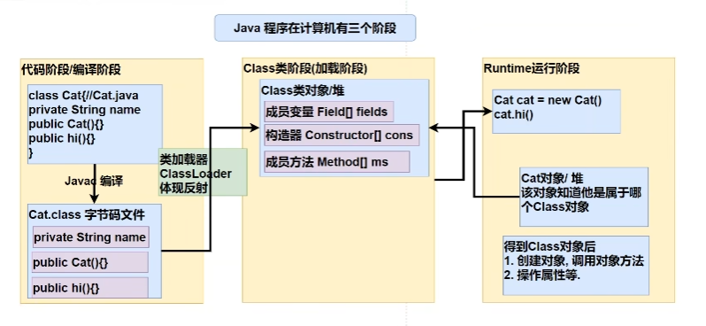
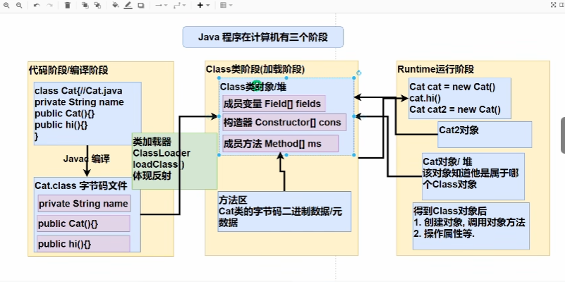
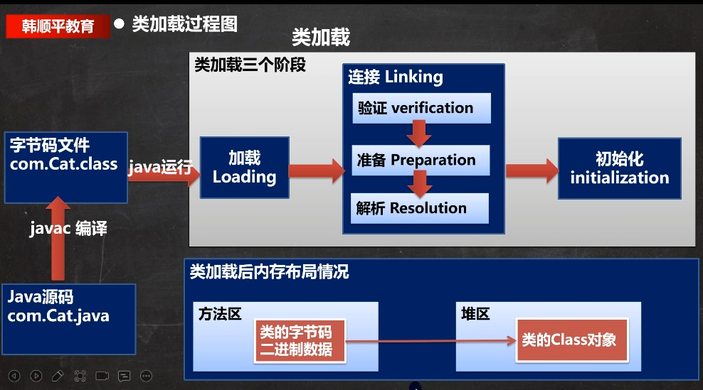
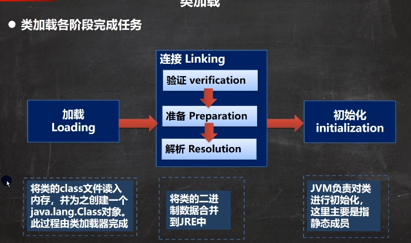

[toc]

# Java-反射

**一个需求引出反射**

1. 根据配置文件 `re.properties` 指定信息，创建 Cat 对象并调用方法 hi

   ~~~java
   classfullpath=com.yujie.Cat; // 这是一个类的全路径
   method=hi
   ~~~

   **使用现有技术实现**

   ~~~java
   // 传统方式
   Cat cat = new Cat();
   cat.hi();
   
   // 尝试使用文件流
   // 1. 使用 Properties 类，读取配置文件
   Properties properties = new Properties();
   properties.load(new FileInputStream("src\\re.properties"));
   // 虽然这个字符串是 com.yujie.Cat,但是不能直接去 new classfullpath，因为他是一个字符串
   String classfullpath = properties.get("classfullpath").toString(); 
   String method = properties.get("method").toString();
   
   // 2. 创建对象，这时传统方法已经行不通了，这时可以使用反射机制实现
   ~~~

   

2. 这样的需求在学习框架时特别多，即通过外部文件配置，在不修改源码情况下，来控制坑许，也符合设计模式的 ocp 原则 ( 开闭原则 )

   ocp 原则：**不修改源码的情况下，扩容功能**

## 反射的快速入门

~~~java
// 1. 加载类,这会返回一个 Class 类型的对象 cls
// 这是一个类型为 Class 的类
Class cls = class.forName(classfullPath);
// 2. 通过 cls 得到加载的类 com.yujie.Cat 的对象实例
Object o = cls.newInstance(); // 这时运行类型就是 Cat，编译类型是 Object
// 3. 这时可以对 o 进行向下转型得到 Cat 对象，但是这时还不知道要调用的是什么方法，所以没有意义
// 所以，这时应该通过 cls 得到加载的类 com.yujie.Cat 的 methodName 的方法对象
// 即：在反射这个机制中，可以把方法视为对象(万物皆对象)
Method method1 = cls.getMethod(method);
// 4. 通过 method1 调用方法，即通过方法对象来实现调用方法
method1.invoke(o); 
// 按传统方法，是 对象.方法()
// 反射机制，是 方法.invoke(对象)

// 这样写的好处就是，如果我不想调用 hi 方法了，想到调用 cry 方法，我只要去配置文件中改一下 method=cry 就可以，不用去改源码
~~~

## 反射的原理 ( Java Reflection )

1. 反射机制允许程序在执行期借助于 `Reflection API` 取得任何类的内部信息 ( 比如成员变量，构造器，成员方法等等 )，并能操作对象的属性及方法。反射在设计模式和框架底层都会用到
2. 加载完类之后，在堆中就产生了一个 Class 类型的对象 ( 一个类只有一个 Class 对象 )，这个对象包含了类的完整结构信息。通过这个对象得到类的结构。这个对象就像一面镜子，透过这个镜子看到类的结构，所以，形象的称之为：反射 

### 原理图

#### 初始版

#### 详细版

## 反射机制可以干什么

1. 在运行时判断任意一个对象所属的类
2. 在运行时构造任意一个类的对象
3. 在运行时得到任意一个类所具有的成员变量和方法
4. 在运行时调用任意一个对象的成员变量和方法
5. 生成动态代理

## 反射相关的主要的类

1. `java.lang.Class: `  代表一个类，Class 对象表示某个类加载后在堆中的对象
2. `java.labg.reflect.Method` 代表类的方法，Method 对象表示某个类的方法
3. `java.lang.reflect.Field` 代表类的成员变量，Field 对象表示某个类的成员变量
4. `java.lang.reflect.Constructor` 代表类的构造方法，Construstor 对象表示构造器

 **这些类在 java.lang.reflect**

~~~java
// 1. 加载类,这会返回一个 Class 类型的对象 cls
// 这是一个类型为 Class 的类
Class cls = class.forName(classfullPath);
// 2. 通过 cls 得到加载的类 com.yujie.Cat 的对象实例
Object o = cls.newInstance(); // 这时运行类型就是 Cat，编译类型是 Object
// 3. 这时可以对 o 进行向下转型得到 Cat 对象，但是这时还不知道要调用的是什么方法，所以没有意义
// 所以，这时应该通过 cls 得到加载的类 com.yujie.Cat 的 methodName 的方法对象
// 即：在反射这个机制中，可以把方法视为对象(万物皆对象)
Method method1 = cls.getMethod(method);
// 4. 通过 method1 调用方法，即通过方法对象来实现调用方法
method1.invoke(o); 
// 按传统方法，是 对象.方法()
// 反射机制，是 方法.invoke(对象)

// java.lang.reflect.Filed: 代表类的成员变量，Field 对象表示某个类的成员变量
// 得到 name 字段，(getField 不能得到私有的属性)
Field nameField = cls.getField("name");
System.out.println(nameField.get(o));
// 传统写法：对象.成员变量
// 反射：成员变量对象.get(对象);

// java.lang.reflect.Constructor: 代表类的构造方法， Constructor 对象表示构造器
Constructor constructor1 = cls.getConstructor(); //()中可以指定构造器参数类型，返回无参构造器
System.out.println(constructor1); // 这里返回的是无参构造器
Constructor constructor2 = cls.getConstructor(String.class); //这里传入的 String.class 就是 String 这个类的 class 对象 
System.out.println(constructor2); // 这里返回的就是参数为 String 的构造器
// 构造器也可以帮我们构造对象
constructor
~~~

## 反射的优点和缺点

- 优点

  **可以动态的创建和适用对象 ( 也是框架底层核心 )，使用灵活，没有反射机制，框架技术就失去底层支撑**

- 缺点

  **使用反射基本是解释执行，对执行速度有影响**

~~~java
// 测试反射调用的性能，和优化方案

// 传统方法来调用 hi
public static void m1(){
    Cat cat = new Cat();
    long start = System.currentTimeMillis();
    for(int i = 0; i < 90000000; i++){
        cat.hi();
    }
    long end = System.currentTimeMillis();
    System.out.println("传统方法来调用hi 耗时=" + (end - start));
}

// 反射机制调用 hi
public static void m2(){
    Class cls = Class.forName("com.yujie.Cat");
    Object o = cls.newInstance();
    Method hi = cls.getMethod("hi");
    long start = System.currentTimeMillis();
    for(int i = 0; i < 90000000; i++){
        hi.invoke(o); // 反射机制调用方法
    }
    long end = System.currentTimeMillis();
    System.out.println("反射机制来调用hi 耗时=" + (end - start));
}
~~~

### 反射调用优化 - 关闭访问检查

1. Method 和 Field、Constructor 对象都有 ` setAccessible()` 方法
2. setAccessible 作用是启动和禁用访问安全检查的开关
3. 参数值为 true 表示反射的对象在使用时取消访问检查，提高反射的效率。参数值为 false 则表示反射的对象执行访问检查

~~~java
// 反射调用优化 - 关闭访问检查
public static void m3(){
    Class cls = Class.forName("com.yujie.Cat");
    Object o = cls.newInstance();
    Method hi = cls.getMethod("hi");
    hi.setAccessible(true); // 在反射调用方法时，取消访问检查
    long start = System.currentTimeMillis();
    for(int i = 0; i < 90000000; i++){
        hi.invoke(o); // 反射机制调用方法
    }
    long end = System.currentTimeMillis();
    System.out.println("反射机制优化后再来调用hi 耗时=" + (end - start));
}
~~~

## Class 类

1. Class 也是类，因此也继承 Object 类

2. Class 类对象不是 new 出来的，而是系统创建的

   ~~~java
   // 1. 传统 new 对象
   // ClassLoader 类;
   // public Class<?> loadClass(String name) throws ClassNotFoundException {
   //    return loadClass(name, false);
   // }
   Cat cat = new Cat();
   
   // 2. 反射方式
   // ClassLoader 类; 仍然是通过 ClassLoader 类加载 Cat 类的 Class 对象
   // public Class<?> loadClass(String name) throws ClassNotFoundException {
   //    return loadClass(name, false);
   // }
   Class cls = Class.forName("com.yujie.Cat");
   ~~~

3. 对于某个类的 Class 类对象，在内存中只有一份，因为类只加载一次

4. 每个类的实例都会记得自己是由哪个 Class 实例所生成

5. 通过 Class 可以完整地得到一个类的完整结构，通过一系列 API

6. Class 对象是存放在堆的

7. 类的字节码二进制数据，是放在方法区的，有的地方成为类的元数据 ( 包括 方法代码，变量名，方法名，访问权限等等 )，

   **示意图：https://www.zhihu.com/question/38496907**

### 常用方法

| 方法名                                                | 功能说明                                                     |
| ----------------------------------------------------- | ------------------------------------------------------------ |
| `static Class forName(String name)`                   | 返回指定类名 name 的 Class 对象                              |
| `Object newInstance()`                                | 调用缺省构造函数，返回该 Class 对象的一个实例                |
| `getName()`                                           | 返回此 Class 对象所表示的实体 ( 类、接口、数组类、基本类型等 ) 名称 【返回全类名】 |
| `getSimpleName`                                       | 获取简单类名                                                 |
| `getPackage`                                          | 以 Class 形式返回 包信息                                     |
| `Class getSuperClass()`                               | 返回当前 Class 对象的父类的 Class 对象                       |
| `Class[] getInterfaces()`                             | 获取当前 Class 对象的接口                                    |
| `ClassLoader getClassLoader()`                        | 返回该类的类加载器                                           |
| `Constructor[] getConstructors()`                     | 返回一个包含某些 Constructor 对象的数组【获取所有 public 修饰的构造器，包含本类以及父类的】 |
| `getDeclaredConstructor`                              | 获取本类中所有构造器                                         |
| `getFields`                                           | 获取所有 public 修饰的属性，包括本类以及父类的               |
| `Field[] getDeclaredFields()`                         | 返回 Field 对象的一个数组【获取本类中所有属性】              |
| `Method getMethod(String name, Class ... paramTypes)` | 返回一个 Method 对象，此对象的形参类型为 paramType           |
| `getMethods`                                          | 获取所有 public 修饰的方法，包含本类以及父类的               |
| `getDeclareMethods`                                   | 获取本类中所有方法                                           |
| `getAnnotations`                                      | 以 Annotation[] 形式返回注解信息   |

~~~java

String classAllPath = "com.yujie.Car"
// 1. 获取到 Car 类对应的 Class 对象
// <?> 表示不确定的 Java 类型
Class<?> cls = Class.forName(classAllPath);
// 2. 输出 cls
// 显示 cls 对象是哪个类的 Class 对象 ---> com.yujie.Car
System.out.println(cls); 
// 输出 cls 运行类型 java.lang.Class
System.out.println(cls.getClass()); // java.lang.Class
// 3. 得到包名
System.out.println(cls.getPackage().getName()); // 包名：com.yujie
// 4. 得到全类名
System.out.println(cls.getPackage().getName()); // 全类名：com.yujie.Car
// 5. 通过 cls 创建对象实例
Car car = (Car) cls.newInstance();
System.out.println(car); // car.toString()
// 6. 通过反射获得属性 name, 这里如果是私有属性会报错
Field name = cls.getField("name");
System.out.println(name.get(car)); // 这里就获取到了 name 属性的值
// 7. 通过反射给属性赋值
name.set(car, "奔驰");
System.out.println(name.get(car)); // 奔驰
// 8. 便利得到所有的属性
Field[] fields = cls.getFields();
for(Field f : fields){
    System.out.println(f.getName()); // 返回各个属性的名称
}
~~~

### 获取 Class 对象的方式

- 通过 Class 类的静态方法 `forName()` 获取，可能抛出 `ClassNotFoundException`

  前提：**已知一个类的全类名，且该类在类路径下**

  语法：`Class cls = Class.forName("java.lang.Cat")`

  应用场景：**多用于配置文件，读取类全路径，加载类**

- 通过类的 class 获取，该方式最为安全可靠，程序性能最高

  前提：**已知具体的类**

  语法：`Class cls = Cat.class`

  应用场景：**多用于参数传递，比如通过反射得到对应构造器对象**

- 调用实例的 getClass 方法获取 Class 对象

  前提：**已知某个类的实例**

  语法：`Class clas = 对象.getClass()` 

  应用场景：**通过创建好的对象，获取 Class 对象**

- 通过 类加载器 获取 Class 对象

  前提：**已知某个类的实例和一个类的全类名，且该类在类路径下**

  语法：`Class cls = 对象.getClass().getClassLoader().loadClass("类的全类名")`

- 基本数据类型 ( int, char, boolean, float, double, byte, long, short ) 按如下方式得到 Class 类对象

  `Class cls = 基本数据类型.class`

- 基本数据类型对应的包装类，可以通过 `.TYPE`得到 Class 类对象

  `Class cls = 包装类.TYPE`

### Java 中哪些类型有 Class 对象

1. 外部类，成员内部类，静态内部类，局部内部类，匿名内部类
2. `interface: ` 接口
3. 数组
4. `enum： ` 美剧
5. `annotation: ` 注解
6. 基本数据类型
7. `void`

~~~java
// 演示
Class<String> cls1 = String.class; // 外部类
Class<Serializable> cls2 = Serializable.class; // 接口
Class<Integer[]> cls3 = Integer[].class; // 数组
Class<float[][]> cls4 = float[][].class; // 二维数组
Class<Deprecated> cls5 = Deprecated.class; // 注解
Class<Thread.state> cls6 = Thread.state.class; // 枚举
Class<long> cls7 = long.class; // 基本数据类型
Class<Void> cls8 = Void.class; // void 数据类型
Class<Class> cls9 = Class.class; // Class 类
~~~

## 类加载

### 基本说明

**反射机制是 java 实现动态语言的关键，也就是通过反射实现类动态加载**

- 静态加载：编译时加载相关的类，如果没有则报错，依赖性太强

  ~~~java
  Scanner scanner = new Scanner(System.in);
  System.out.println("请输入key");
  String key = scanner.next();
  switch(key){
      case 1:
          // 这里运行会报错，Dog 找不到，但是不是在我输入 1 之后报的错，而是编译直接报错
          // 所以这里是 静态加载， 依赖性很强
          Dog dog = new Dog();
          break;
      case 2:
          System.out.println("ok");
          break;
      default:
          System.out.println("do nothing...");
          break;
  }
  
  ~~~

- 动态加载：运行时加载需要的类，如果运行时不用该类，即使不存在该类也不报错，降低了依赖性

  ~~~java
  Scanner scanner = new Scanner(System.in);
  System.out.println("请输入key");
  String key = scanner.next();
  switch(key){
      case 1:
          // 这里运行会报错，Dog 找不到，但是不是在我输入 1 之后报的错，而是编译直接报错
          // 所以这里是 静态加载, 依赖性很强
          Dog dog = new Dog();
          dog.cry();
          break;
      case 2:
          // 这里会加载 Person
          // 这里是反射，在编译时不会加载，而是执行到这个代码时才会加载
          // 所以反射 -> 动态加载
          Class cls = Class.forName("Person");
          Object o = cls,newInstance();
          Method m = cls.getMethod("hi");
          m.invoke(o);
          System.out.println("ok");
          break;
      default:
          System.out.println("do nothing...");
          break;
  }
  
  // 因为 new Dog 是静态加载，因此必须编写 Dog
  // Person 类是动态加载，所以，没有编写 Person 类也不会报错，只有当动态加载该类时，才会报错
  class Dog {
      public void cry(){
          System.out.println("小狗汪汪叫");
      }
  }
  
  class Person {
      public void hi(){
          System.out.println("小孩 hi");
      }
  }
  ~~~

  

### 类加载时机

- 当创建对象时 ( new )    --->    静态加载
- 当子类被加载时，父类也加载    --->    静态加载
- 调用类中的静态成员时    --->    静态加载
- 通过反射    --->    动态加载

### 类加载流程图

### 类加载各阶段完成任务

#### 加载阶段

**JVM 在该阶段的主要目的是将字节码从不同的数据源 ( 肯呢个是 class 文件、也可能是 jar 包，甚至网络 ) 转化为二进制字节流加载到内存中，并生成一个代表该类的 java.lang.Class 对象**

#### 连接阶段

##### 验证

1. 目的是为了确保 Class 文件的字节流中包含的信息符合当前虚拟即的要求，并且不会危害虚拟机自身的安全
2. 包括：文件格式验证 ( 是否以模数 oxcafebabe 开头 )、元数据验证、字节码验证和符号引用验证
3. 可以考虑使用 -Xverify:none 参数来关闭大部分的类验证措施，缩短虚拟机类加载的时间

##### 准备

**JVM 会在该阶段对静态变量,分配内存并默认初始化 ( 对应数据类型的么默认初始值, 如 0、0L、null、false 等 )。这些变量所使用的内存都将再方法去中进行分配**

~~~java
class A {
  // 1. n1 是实例属性，不是静态变量，因此再准备i阶段，是不会分配内存的
  public int n1 = 10;
  // 2. n2 是静态变量，就会分配内存， n2 的值在准备阶段默认初始化 0，而不是 20 ，会在加载的初始化阶段才会赋值 20
  public static int n2 = 20;
  // 3. n3 是 static final，是一个常量，他和静态变量不一样，因为一旦赋值就不会改变了，所以在准备阶段 n3 = 30
  public static final int n3 = 30;
}
~~~

##### 解析

**虚拟机将常量池内的符号引用替换为直接引用的过程**

#### 初始化阶段 （Initalization）

1. 到初始化阶段，才真正开始执行类中定义的 Java 程序代码，此阶段是执行 `<clinit>()` 方法的过程
2. `<clinit>()` 方法是由编译器按语句在源文件中出现的顺序，依次自动收集类中的所有 **静态变量** 的赋值动作和静态代码块中的语句，并进行合并
3. 虚拟机会保证一个类的 `<clinit>()` 方法在多线程环境中被正确的加锁、同步，如果多个线程同时去初始化一个类，那么只会有一个线程去执行这个类的 `<clinit>()` 方法，其他线程都需要阻塞等待，知道活动线程执行 `<clinit>()` 方法完毕

~~~java
class B {
  static {
    System.out.println("B 静态代码块被执行");
    num = 300;
  }
  static int num = 100;
  public B(){
     System.out.println("B 构造器被执行");
  }
}

// 1. 加载 B 类，并生成 B 的 calss 对象
// 2. 链接 num = 0
// 3. 初始化阶段
// 3.1 依次自动收集类中的所有 静态变量 的赋值动作和静态代码块中的语句
// clinit(){
//   System.out.println("B 静态代码块被执行");
//   num = 300;
//	 num = 100;
// }
// 3.2 合并
// clinit(){
//   System.out.println("B 静态代码块被执行");
//	 合并：num = 100;
// }

System.out.println(B.num); // 100, 如果直接使用类的静态属性，也会导致类的加载
~~~

3. 可以考虑使用 -Xverify:none 参数来关闭大部分的类验证措施，缩短虚拟机类加载的时间