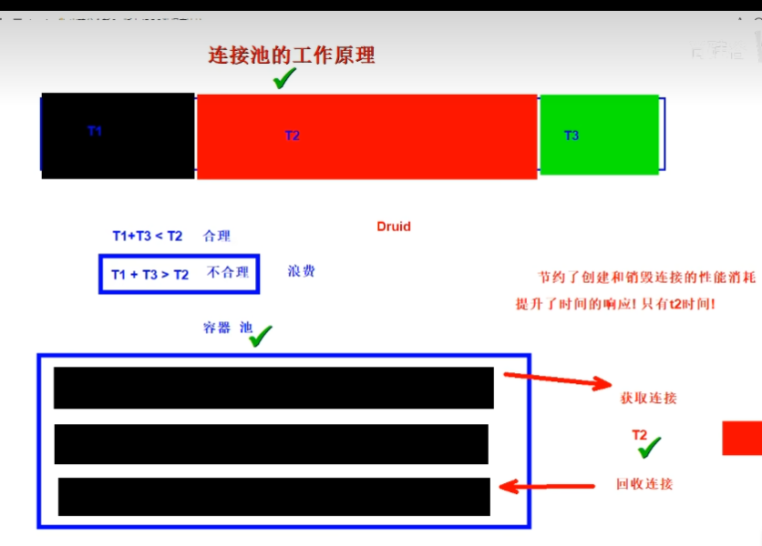

[toc]

# jdbc 扩展提升

## 自增长主键回显实现

### 实现思路

1. java 程序获取插入数据时 mysql 维护自增加维护的主键 id 值，这就是主键回显
2. 作用：在多表关联插入数据时，一般主表的主键都是自动生成的，所以在插入数据之前无法知道这条数据的主键，但是从表需要再插入数据之前就绑定主表的主键，这时可以使用主键回显数据

### 实现代码

~~~java
/**
   * TODO:
   *    t_user 插入一条数据！并且获取数据库自增长的键值
   *
   *  TODO: 使用总结
   *      1. 在创建 preparedStatement 的时候，告知，鞋带会数据库自增长的主键 (sql, statement.RETURN_GENERATED_KEYS)
   *      2. 获取装主键值的结果集对象，一行一列，获取对应的数据即可 ResultSet generatedKeys = preparedStatement.getGeneratedKeys();
   */
  @Test
  public void returnPrimaryKey() throws ClassNotFoundException, SQLException {
      // 1. 注册驱动
        Class.forName("com.mysql.cj.jdbc.Driver");
      // 2. 获取连接
        Connection connection = DriverManager.getConnection("jdbc:mysql:///my_test", "root", "319612");
      // 3. 编写 SQL
        String sql = "INSERT INTO t_user(account, password, nickname) values(?,?,?)";
      // 4. 创建 statement
        PreparedStatement preparedStatement = connection.prepareStatement(sql, Statement.RETURN_GENERATED_KEYS);
      // 5.占位符赋值
        preparedStatement.setObject(1, "test");
        preparedStatement.setObject(2, "test1");
        preparedStatement.setObject(3, "test3");
      // 6. 发送 SQL 语句
        int i = preparedStatement.executeUpdate();
      // 7. 结果解析
        if(i > 0){
          System.out.println("数据插入成功");
          // 获取回显的主键
          // 获取装主键的结果集对象，一行一列，id = 值
          ResultSet generatedKeys = preparedStatement.getGeneratedKeys();
          generatedKeys.next();
          int id = generatedKeys.getInt(1);
          System.out.println("id=" + id);
        } else {
          System.out.println("数据插入失败");
        }
      // 8. 关闭资源
        preparedStatement.close();
        connection.close();
~~~

## 批量数据插入性能提升

### 一个个插入

~~~java
/**
   * 使用普通的方式插入 10000 条数据
   */
  @Test
  public void testInsert() throws ClassNotFoundException, SQLException {
    // 1. 注册驱动
    Class.forName("com.mysql.cj.jdbc.Driver");
    // 2. 获取连接
    Connection connection = DriverManager.getConnection("jdbc:mysql:///my_test", "root", "319612");
    // 3. 编写 SQL
    String sql = "INSERT INTO t_user(account, password, nickname) values(?,?,?)";
    // 4. 创建 statement
    PreparedStatement preparedStatement = connection.prepareStatement(sql, Statement.RETURN_GENERATED_KEYS);
    // 5.占位符赋值
    long start = System.currentTimeMillis();
    for (int i = 3; i < 10000; i++) {
      preparedStatement.setObject(1, "test" + i);
      preparedStatement.setObject(2, "test" + i);
      preparedStatement.setObject(3, "testtest" +i);
      // 6. 发送 SQL 语句
      preparedStatement.executeUpdate();
    }
    long end = System.currentTimeMillis();
    // 7. 结果解析
    System.out.println("执行 10000 数据插入消耗的时间 = " + (end - start));

    // 8. 关闭资源
    preparedStatement.close();
    connection.close();
  }
~~~

### 批量插入

~~~java
 /**
   * 使用批量插入的方式插入 10000 条数据
   * TODO:
   *    1. 路径后面添加 rewriteBatchedStatements=true 表示允许插入
   *    2. insert into 后必须写 values，并且语句不能添加 ; 结束
   *    3. 不能执行语句每条，是批量添加 addBatch()
   *    4. 遍历添加完毕以后，统一批量执行 executeBatch()
   */
  @Test
  public void testBatchInsert() throws ClassNotFoundException, SQLException {
    // 1. 注册驱动
    Class.forName("com.mysql.cj.jdbc.Driver");
    // 2. 获取连接
    Connection connection = DriverManager.getConnection("jdbc:mysql:///my_test?rewriteBatchedStatements=true", "root", "319612");
    // 3. 编写 SQL
    String sql = "INSERT INTO t_user(account, password, nickname) values(?,?,?)";
    // 4. 创建 statement
    PreparedStatement preparedStatement = connection.prepareStatement(sql, Statement.RETURN_GENERATED_KEYS);
    // 5.占位符赋值
    long start = System.currentTimeMillis();
    for (int i = 3; i < 10000; i++) {
      preparedStatement.setObject(1, "test" + i);
      preparedStatement.setObject(2, "test" + i);
      preparedStatement.setObject(3, "testtest" +i);
      // 不执行，追加到 values 后面
      preparedStatement.addBatch();
    }
    // 执行批量操作
    preparedStatement.executeBatch();
    long end = System.currentTimeMillis();
    // 7. 结果解析
    System.out.println("执行 10000 数据插入消耗的时间 = " + (end - start));

    // 8. 关闭资源
    preparedStatement.close();
    connection.close();
  }
~~~

## jdbc 中数据事务实现

### 业务层

~~~java
package com.yujie.transaction;

import org.junit.jupiter.api.Test;

import java.sql.Connection;
import java.sql.DriverManager;
import java.sql.SQLException;

/**
 * @Author: 余杰
 * @Description: 银行卡业务方法，调用 Dao 方法
 * @Program JdbcTest
 * @Create 2023-06-17-21-25
 */
public class BankService {

  @Test
  public void start() throws SQLException, ClassNotFoundException {
    transfer("黑皮","灰灰",50);
  }

  /**
   * TODO:
   *    事务添加是在业务方法中
   *      利用 try catch 代码块，开启事务和提交事务，和事务回滚
   *      将 connection 传入 dao 层即可，dao 只负责使用，不要 close
   * @param addAccount
   * @param subAccount
   * @param money
   * @throws SQLException
   * @throws ClassNotFoundException
   */
  public void transfer(String addAccount, String subAccount, int money) throws SQLException, ClassNotFoundException {
    BankDao bankDao = new BankDao();

    // 一个事务的最基本要求，必须是同一个连接对象 connection

    // 一个转账方法，属于一个事务 (加钱减钱)
    Class.forName("com.mysql.cj.jdbc.Driver");
    Connection connection = DriverManager.getConnection("jdbc:mysql:///my_test", "root", "319612");
    try {
      // 开启事务
      connection.setAutoCommit(false);
      // 执行数据库动作
      bankDao.add(addAccount, money, connection);
      System.out.println("-----------------------");
      bankDao.sub(subAccount, money, connection);
      // 事务提交
      connection.commit();
    } catch (Exception e) {
      // 事务回滚
      connection.rollback();
      // 抛出异常信息
      throw e;
    } finally {
      connection.close();
    }
  }
}
~~~

### 方法层

~~~java
package com.yujie.transaction;

import java.sql.Connection;
import java.sql.DriverManager;
import java.sql.PreparedStatement;
import java.sql.SQLException;

/**
 * @Author 余杰
 * @Date 2023/6/17 21:16
 * @PackageName: com.yujie.transaction
 * @ClassName: BankDao
 * @Description: TODO
 * @Version 1.0
 */
public class BankDao {
  /**
   * 加钱的数据库操作方法
   * @param account 加钱的账号
   * @param money 加钱的金额
   */
  public void add(String account, int money, Connection connection) throws SQLException, ClassNotFoundException {
    // 3. 编写 SQL 语句结果
    String sql = "UPDATE t_bank SET money = money + ? where account = ?";
    // 4. 创建 statement
    PreparedStatement preparedStatement = connection.prepareStatement(sql);
    // 5. 占位符赋值
    preparedStatement.setInt(1, money);
    preparedStatement.setString(2, account);
    // 6. 发送 SQL 语句
    int i = preparedStatement.executeUpdate();

    // 7. 关闭资源
    preparedStatement.close();

    System.out.println("加钱成功");
  }

  /**
   * 减钱的数据库操作方法
   * @param account 减钱的账号
   * @param money 减钱的金额
   */
  public void sub(String account, int money, Connection connection) throws ClassNotFoundException, SQLException {
    String sql = "UPDATE t_bank set money = money - ? WHERE account = ?";
    PreparedStatement preparedStatement = connection.prepareStatement(sql);
    preparedStatement.setInt(1,money);
    preparedStatement.setString(2, account);

    int i = preparedStatement.executeUpdate();
    preparedStatement.close();
    System.out.println("减钱成功");
  }
}
~~~

## Druid 连接池技术

普通的 jdbc 每次都会关闭连接，造成了很大的资源浪费，这个技术可以使连接复用

### 连接池工作原理

### 硬编码方式：代码中写死

~~~java
/**
   * 直接使用代码设置连接池连接参数方式
   *    1. 创建一个 druid 连接池对象
   *    2. 设置连接池参数 [ 必须 | 非必须 ]
   *    3. 获取连接 [ 通用方法, 所有连接池都一样 ]
   *    4. 回收链接 [ 通用方法, 所有连接池都一样 ]
   */
  public void testHard() throws SQLException {
    // 连接池对象
    DruidDataSource dataSource = new DruidDataSource();

    // 设置参数
    // 必须参数 连接数据库驱动类的全限定符[注册驱动] | url | user | password
    dataSource.setUrl("jdbc:mysql://localhost:3306/my_test");
    dataSource.setUsername("root");
    dataSource.setPassword("319612");
    dataSource.setDriverClassName("com.mysql.cj.jdbc.Driver"); // 帮助我们进行驱动注册和获取连接
    // 非必须 初始化连接数量，最大的连接数量
    dataSource.setInitialSize(5); // 初始化的数量
    dataSource.setMaxActive(10); // 最大的数量

    // 获取连接
    DruidPooledConnection connection = dataSource.getConnection();

    // 数据库 CURD

    // 回收链接
    // 连接池提供的连接，close，就是回收方法
    connection.close();
  }
~~~

### 软编码方式：读取配置文件

~~~java
// 1. 读取外部配置文件 Properties
Properties properties = new Properties();
// src 下的文件，可以使用类加载器提供的方法
InputStream resourceAsStream = DruidUsePart.class.getClassLoader().getResourceAsStream("druid.properties");
properties.load(resourceAsStream);
// 2. 使用连接池的工具吃的工程模式，创建连接池
DataSource dataSource = DruidDataSourceFactory.createDataSource(properties);
Connection connection = dataSource.getConnection();

// 数据库 curd

// 回收连接
connection.close();

// src 下还有一个 druid.properties
// key = value => java Properties 读取 (key | value)
// druid 配置的 key 固定命名
driverClassName=com.mysql.cj.jdbc.Driver
username=root
password=319612
url=jdbc:mysql://localhost:3306/my_test
~~~

### 工具类的封装

#### 工具类v1.0

> 封装一个工具类，内部包含连接池对象，同时对外提供连接的方法和回收连接的方法

外部配置文件：`src/druid.properties` 同上

~~~java
public class JdbcUtils {
  private static DataSource dataSource = null; // 连接池对象
  static {
    Properties properties = new Properties();
    InputStream resourceAsStream = JdbcUtils.class.getClassLoader().getResourceAsStream("druid.properties");
    try {
      properties.load(resourceAsStream);
      dataSource = DruidDataSourceFactory.createDataSource(properties);
    } catch (Exception e) {
      throw new RuntimeException(e);
    }

  }

  public static Connection getConnect() throws SQLException {
    return dataSource.getConnection();
  }

  public static void freeConnect(Connection connection) throws SQLException {
    // 连接池的连接，调用 close 就是回收
    connection.close();
  }
}
~~~

#### 工具类v2.0

> 优化工具类v1.0版本，考虑事务的情况下，如何一个线程的不同方法获取同一个连接

##### ThreadLocal 线程共享变量

**可以为同一个线程存储共享变量**

~~~java
package com.yujie.utils;

import com.alibaba.druid.pool.DruidDataSourceFactory;

import javax.sql.DataSource;
import java.io.IOException;
import java.io.InputStream;
import java.sql.Connection;
import java.sql.SQLException;
import java.util.Properties;

/**
 * @Author: 余杰
 * @Description:
 * @Program JdbcTest
 * @Create 2023-06-17-22-32
 *
 * v1.0 版本工具类
 *    内部包含一个连接池对象，并且对外提供获取连接和回收连接的方法
 *
 * 小建议：
 *    工具类的方法，推荐写成静态，外部调用会更方便
 *
 * 实现:
 *    属性：连接池对象 [ 实例化一次 ]
 *          单例模式
 *          静态代码块
 *    方法：
 *        对外提供连接的方法
 *        回收外部传入连接方法
 *
 * TODO:
 *    利用线程本地变量，存储连接信息，确保一个线程的多个方法可以获取同一个 connection
 *    优势：实物操作的时候 service 和 dao 方法属于同一个线程没救不用再传递参数了
 *    大家都可以调用 getConnection 自动获取的就是相同的连接池
 */
public class JdbcUtilsV2 {
  private static DataSource dataSource = null; // 连接池对象
  private static ThreadLocal<Connection> tl = new ThreadLocal<>();

  static {
    Properties properties = new Properties();
    InputStream resourceAsStream = JdbcUtils.class.getClassLoader().getResourceAsStream("druid.properties");
    try {
      properties.load(resourceAsStream);
      dataSource = DruidDataSourceFactory.createDataSource(properties);
    } catch (Exception e) {
      throw new RuntimeException(e);
    }

  }

  public static Connection getConnect() throws SQLException {
    // 首先查看线程本地变量中是否存在
    Connection connection = tl.get();
    if(connection == null){
      // 如果线程本地变量没有，就从线程池获取
      connection = dataSource.getConnection();
      tl.set(connection);
    }
    return connection;
  }

  public static void freeConnect() throws SQLException {
    Connection connection = tl.get();
    if(connection != null) {
      // 清空线程本地变量数据
      tl.remove();
      // 事务状态回归
      connection.setAutoCommit(true);
      // 连接池的连接，调用 close 就是回收
      connection.close();
    }
  }
}
~~~

#### 高级应用层封装 baseDao

> 基本上每一个数据表都应该有一个对应的 DAO 接口及其实现类，发现对所有表的操作 ( 增删改查 )，代码重复度很高，所以可以抽取公共代码，给这些 DAO 的实现类可以抽取一个公共的父类，我们称为 BaseDao

##### 非 DQL 语句封装

~~~java
 /**
   * 封装简化非 DQL 语句
   * @param sql     带占位符的 SQL 语句
   * @param params  占位符的值
   * @return        执行影响的行数
   */
  public int executeUpdate(String sql, Object... params) throws SQLException {
    // 获取连接
    Connection connect = JdbcUtilsV2.getConnect();
    PreparedStatement preparedStatement = connect.prepareStatement(sql);

    // 可变参数可以当做数组使用
    for (int i = 0; i < params.length; i++) {
      preparedStatement.setObject(i + 1, params[i]);
    }
    // 发送 SQL 语句
    int i = preparedStatement.executeUpdate();
    preparedStatement.close();

    // 是否回收连接，需要考虑是不是事务
    // 如果为 true 代表没有开启事务
    boolean autoCommit = connect.getAutoCommit();
    if(autoCommit){
      JdbcUtilsV2.freeConnect();
    }

    return i;
  }
~~~

##### DQL 语句封装

~~~java
/**
   * 非 DQL 语句封装方法 -> 返回值固定位 int
   *
   * DQL 语句封装方法 -> 返回值是什么类型呢?
   *    数据库数据 -> java 的实体类
   *    表中 -> 一行 -> java类的一个对象 -> 多行 -> List<Java实体类> list;
   */
  // T 声明一个泛型，不确定类型
  //    传入一个 Class 对象
  //       1. 确定泛型的值
  //       2. 使用反射技术对属性赋值

  /**
   * 将查询结果封装到一个实体类集合
   * @param clazz   要接值的实体类集合的模版对象
   * @param sql     查询语句，要求列名或者别名等于实体类的属性名
   * @param params  占位符的值，要和 ? 位置对应传递
   * @return        查询的实体类集合
   * @param <T>     声明的结果的泛型
   * @throws SQLException
   * @throws InstantiationException
   * @throws IllegalAccessException
   * @throws NoSuchFieldException
   */
  public <T> List<T> executeQuery(Class<T> clazz, String sql, Object... params) throws SQLException, InstantiationException, IllegalAccessException, NoSuchFieldException {
    Connection connect = JdbcUtilsV2.getConnect();

    PreparedStatement preparedStatement = connect.prepareStatement(sql);

    if(params != null && params.length != 0){
      for (int i = 0; i < params.length; i++) {
        preparedStatement.setObject(i + 1, params[i]);
      }
    }
    ResultSet resultSet = preparedStatement.executeQuery();
    ResultSetMetaData metaData = resultSet.getMetaData();
    int columnCount = metaData.getColumnCount();
    ArrayList<T> ts = new ArrayList<>();
    while (resultSet.next()){
      // 一行数据对应一个 T 类型的对象
      // 调用类的无参构造起函数实例化对象
      T t = clazz.newInstance();
      for (int i = 1; i <= columnCount; i++) {
        // 对象的属性名
        String columnLabel = metaData.getColumnLabel(i);
        // 对象的属性值
        Object object = resultSet.getObject(i);

        // 反射，给对象的属性值赋值
        Field declaredField = clazz.getDeclaredField(columnLabel);
        // 属性可以设置，打破 private 的修饰限制
        declaredField.setAccessible(true);
        /**
         *  参数1：要复制的对象，如果属性是静态属性，那么第一个参数可以为空
         *  参数2：具体的属性值
         */
        declaredField.set(t, object);
      }
      ts.add(t);
    }
    // 关闭资源
    resultSet.close();
    preparedStatement.close();
    if(connect.getAutoCommit()){
      JdbcUtilsV2.freeConnect();
    }
    return ts;
  }
~~~