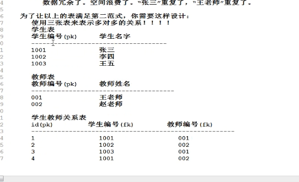
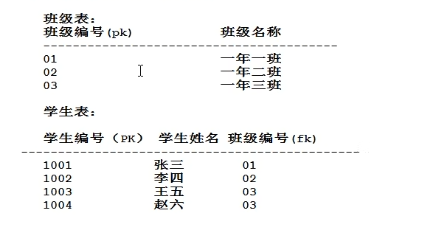

[toc]

# 数据库设计范式

## 什么是数据库设计范式

数据库表的设计依据，叫你怎么进行数据库表的设计

## 设计库设计范式有三个

- 要求任何一张表必须有主键，每一个字段原子性不可再分
- 建立在第一范式的基础之上，要求所有非主键字段完全依赖主键，不要产生部分依赖
- 建立在第二范式的基础之上，要求所有非主键字段直接依赖主键，不要产生传递依赖

设计数据库表的时候，按照以上的范式进行，可以避免表中数据的冗余，空间的浪费

### 第一范式

最核心，最重要的范式，所有表的设计都需要满足

要求任何一张表必须有主键，每一个字段原子性不可再分

### 第二范式

建立在第一范式的基础之上，要求所有非主键字段完全依赖主键，不要产生部分依赖

### 第三范式

建立在第二范式的基础之上，要求所有非主键字段直接依赖主键，不要产生传递依赖

## 口诀

- 多对多怎么设计

  **多对多，三张表，关系表两个外键**

- 一对多怎么设计

  **一对多，两张表，多的表加外键**

## 总结表的设计

- 一对多：**一对多，两张表，多的表加外键**

- 多对多：**多对多，三张表，关系表两个外键**

- 一对一

  - 一对一放到一张表中不就行了吗？为什么还要拆分表？

    在实际的开发中，可能存在一张表字段太多，太庞大。这个时候要拆分表

  - 一对一怎么设计？

    **一对一，外键唯一**

## 真实设计

* 数据库设计三范式是理论上的
* 实践和理论有的时候有偏差
* 最终的目的都是为了满足客户的需求，有的时候会拿冗余换执行速度
* 因为在 SQL 当中，表和表之间连接次数越多，效率越低 ( 笛卡尔积 )
* 有的时候肯呢个会存在冗余，但是为了减少表的连接次数，这样做也是合理的，并且对于开发人员来说，SQL 语句的编写难度也会降低