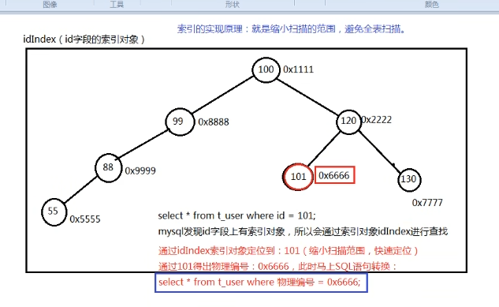

[toc]

# 索引 ( index  )

## 什么是索引

- 索引在数据库表的字段上添加的，是为了提高查询效率存在的一种机制

- 一张表的一个字段可以添加一个索引，当然，多个字段联合起来也可以添加索引

- 索引相当于一本书的目录，是为了缩小扫描范围而存在的一种机制

对于一本字典来说，查找某个汉字有两种方式：

1. 一页一页挨着找，直到找到位置，这种查找方式属于全字典扫描，效率比较低
2. 先通过目录 ( 索引 ) 去定位一个大概的位置，然后直接定位到这个位置，做局域性扫描，缩小扫描的方位，快速的查找，这种查找方式属于通过索引检索，效率较高

~~~sql
select * from t_user where name = 'jack'

# 以上的这条 SQL 语句会去 name 字段上扫描，为什么?
	# 因为查询条件是：name=’jack‘
# 如果 name 字段上没有添加索引(目录)，或者说没有给 name 字段创建索引，MySQL 会进行全扫描，会将 name 字段上的每一个值都比对一遍.效率比较低
~~~

### mysql 的查询方式

1. 全表扫描
2. 根据索引检索

### 注意

- 在 mysql 数据库中索引也是需要排序的，并且这个索引的排序和 TreeSet 数据结构相同。TreeSet ( TreeMap ) 底层是一个自平衡的二叉树，在 mysql 当中索引是一个 B-Tree 数据结构
- 遵循左小右大原则存放，采用中序遍历方式遍历取数据

## 索引的实现原理

- **在任何数据库当中主键上都会自动添加索引对象**

- **在 mysql 当中，一个字段上如果有 unique 约束的话，也会自动创建索引对象**
- 在任何数据库当中，任何一张表的任何一条记录在硬盘存储上都有一个硬盘的物理存储编号
- 在 mysql 当中，索引是一个单独的对象，不同的存储引擎以不同的形式存在，在 MyISAM 存储引擎中，索引存储在一个 .MYI 文件中。在 InnoDB 存储引擎中索引存储在一个逻辑名称叫做 tablespace 的当中。在 MEMORY 存储引擎当中索引被存储在内存中，不管索引存储在哪里，索引在 mysql 当中都是一个树的形式存在。( 自平衡二叉树：B-Tree )

索引的实现原理就是缩小扫描的范围，避免全表扫描

## 什么时候添加索引

- 数据量庞大 ( 到底有多么庞大算庞大，这个需要测试，因为每一个硬件环境不同 )
- 该字段经常出现在 `where` 后面，以条件的形式存在，也就是说这个字段总是被扫描
- 该字段很少的 DML 操作 ( 因为 DML 之后，索引需要重新排序 )

不要随意添加索引，因为索引也是需要维护的，太多的话反而会降低系统的性能。

建议通过主键或者 unique 约束的字段进行查询，效率是比较高的

## 索引的命令

### 创建索引

`create index 索引名 on 表名(字段名)`

#### 例如

- 给 emp 表的 ename 字段添加索引，起名：`emp_ename_index`

  `create index emp_ename_index on emp(ename)`

### 删除索引

`drop index 索引名 on 表名`

#### 例如

- 将 emp 表上的 emp_ename_index 索引对象删除

  `drop index emp_ename_index on emp`

### 查看SQL语句是否使用了索引检索

`explain SQL语句`

## 索引失效

即添加了索引也不会走索引

- 模糊匹配中以 `%` 开始

  `select * from emp where ename like '%T'`

- 使用 `or` 的时候，要求 `or` 两边的条件字段都要有索引，才会走索引，这就是不建议使用 `or` 的原因

  `select * from emp where ename = 'KING' or jon = 'MANAGER'`

  这时 ename 有索引， job 没有索引，所以索引失效了

- 使用复合索引的时候，没有使用左侧的列查找，索引失效

  复合索引：

  - 两个字段，或者更多的字段联合起来添加一个索引，叫做复合索引

    `create index emp_job_sal_index on emp(job,sal)`

  `select * from emp where job = 'MANAGER'`：会使用索引

  `select * from emp where sal = 800`：不会使用索引

- 在 `where` 当中索引列参加了运算

  - `create index emp_sal_index on emp(sal)`
  - `select * from emp where sal = 800`：使用索引
  - `select * from emp where sal + 1 = 800`：索引失效

- 在 `where` 当中索引列使用了函数

  `select * from emp where lower(ename) = 'smith'`：索引失效

## 索引的分类

- 单一索引：一个字段上添加索引
- 复合索引：两个字段或者更多的字段上添加索引
- 主键索引：主键上添加索引
- 唯一性索引：具有 unique 约束的字段上添加索引

注意：唯一性比较弱的字段上添加索引用处不大