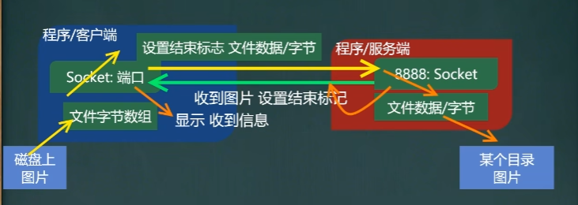

[toc]

# Java 网络编程

## InetAddress 类

### 相关方法

1. 获取本机 InetAddress 对象：`getLocalHost`
2. 根据指定主机名 / 域名获取 ip 地址对象：`getByName`
3. 获取 InetAddress 对象的主机名：`getHostName`
4. 获取 InetAddress 对象的 ip 地址：`getHostAddress`

~~~Java
// 演示 InetAddress 类的使用
// 1. 获取本机的 InetAddress 对象
InetAddress localhost = InetAddress.getLocalHost(); // 返回计算机名 + / + ip 地址
// 2. 根据指定主机名 / 域名获取 InetAddress 对象
InetAddress host1 = InetAddress.getByName(计算机名);
// 3. 根据域名获取 InetAddress 对象，比如百度的
InetAddress host2 = InetAddress.getByName("www.baidu.com"); // 返回 www.baidu.com + / + ip 地址
// 4. 通过 InetAddress 对象，获取对应的 ip 地址
String hostAddress = host2.getHostAddress(); // IP 
// 5. 通过 InetAddress 对象，获取对应的主机名或者域名
String hostName host2.getHostName(); // 主机名或者域名
~~~
## Socket

### 读写数据

1. `socket.getOutputStream`
2. `socket.getInputStream`

### Socket 有两种编程方式

1. TPC 编程方式	->	可靠的
2. UDP 编程方式    ->    不可靠的

### 基本介绍

1. 基于客户端 ----- 服务端的网络通信
2. 底层使用的是 TCP / IP 协议
3. 应用场景：客户端发送数据，服务端接收并显示
4. 基于 Socket 的 TCP 编程

## TCP 网络通信编程

### 案例

#### 案例1：传输文本

1. 编写一个服务器端，和一个客户端
2. 服务器端在 9999 端口监听
3. 客户端连接到服务器端，发送 `hello,server`，并接收服务器返回的 `hello,client` 然后再退出
4. 服务器端接收到客户端发送的消息，输出，并发送 `hello,client` 再退出

- 使用字节流 

  ~~~java
  // 服务端
    // 1. 在本机的 9999 端口监听，等待连接
    // 这句话要求 9999 端口没有被占用，如果已经被占用，会失败
    ServerSocket serverSocket = new ServerSocket(9999);
    System.out.println("服务端在 9999 端口监听，等待连接");
    // 2. 当没有客户端连接 9999 端口时，程序会阻塞，等待连接
    // 如果有客户端连接，则会返回一个 Socket 对象
    // 这个 ServerSocket 可以通过 accept 方法返回多个 Socket(多个客户端连接服务器的并发)
    Socket socket = serverSocket.accept();
    System.out.println("服务端socket=" + socket.getClass());
    // 3. 通过 Socket.getInputStream 方法得到与 Socket 关联的输入流对象
    InputStream inputStream = socket.getInputStream();
    // 4. IO 读取信息
    byte[] buf = new byte[10224];
    int len = 0;
    while ((len = inputStream.read(buf)) != -1){
      System.out.print(new String(buf,0, len)); //根据得到的实际长度，提示内容
    }
  
    // 5. 获取 socket 相关联的输出流，并向客户端发送消息 hello，client
    OutputStream outputStream = socket.getOutputStream();
    outputStream.write("hello,client".getBytes());
    // 设置结束标记
    socket.shutdownOutput();
    System.out.println("发送了 client");
  
    // 6. 关闭流和 socket，serverSocket
    outputStream.close();
    inputStream.close();
    socket.close();
    serverSocket.close();
    System.out.println("服务端关闭了");
  
  
  //客户端
    // 1. 连接服务端 (ip, 端口号)
    // 解读：连接本机的 9999 端口，如果连接成功，返回 Socket 对象
    Socket socket = new Socket(InetAddress.getLocalHost(), 9999);
    System.out.println("客户端得到socket=" + socket.getClass());
    // 2. 连接上后，生成 Socket，通过 Socket.getOutputStream 方法得到与 Socket 关联的输出流对象
    OutputStream outputStream = socket.getOutputStream();
    // 3. 通过输出流，写入数据到数据通道
    outputStream.write("hello,server".getBytes());
    // 设置结束标记
    socket.shutdownOutput();
  
    // 4. 读取和 socket 关联的输入流，读取数据(字节)，并显示
    InputStream inputStream = socket.getInputStream();
    byte[] buf = new byte[1024];
    int len = 0;
    while ((len = inputStream.read(buf)) != -1){
      System.out.print(new String(buf,0,len));
    }
    System.out.println("接收到了");
  
    // 5. 关闭流对象和 socket，必须关闭，不然会造成资源浪费
    inputStream.close();
    outputStream.close();
    socket.close();
    System.out.println("客户端退出了~");
  ~~~

- 使用字符流

  ~~~java
  //服务端
    // 1. 在本机的 9999 端口监听，等待连接
    // 这句话要求 9999 端口没有被占用，如果已经被占用，会失败
    ServerSocket serverSocket = new ServerSocket(9999);
    System.out.println("服务端在 9999 端口监听，等待连接");
    // 2. 当没有客户端连接 9999 端口时，程序会阻塞，等待连接
    // 如果有客户端连接，则会返回一个 Socket 对象
    // 这个 ServerSocket 可以通过 accept 方法返回多个 Socket(多个客户端连接服务器的并发)
    Socket socket = serverSocket.accept();
    System.out.println("服务端socket=" + socket.getClass());
    // 3. 通过 Socket.getInputStream 方法得到与 Socket 关联的输入流对象
    InputStream inputStream = socket.getInputStream();
    BufferedReader bufferedReader = new BufferedReader(new InputStreamReader(inputStream));
    // 4. IO 读取信息
    String line = bufferedReader.readLine();
    System.out.println("接收到" + line);
  
    // 5. 获取 socket 相关联的输出流，并向客户端发送消息 hello，client
    OutputStream outputStream = socket.getOutputStream();
    BufferedWriter bufferedWriter = new BufferedWriter(new OutputStreamWriter(outputStream));
    bufferedWriter.write("hello,client");
    // 设置结束标记 插入一个换行符，表示写入的内容结束，
    // 注意：要求对方使用 readLine 来阅读，不然读不到换行符
    bufferedWriter.newLine();
    //如果使用的是字符流，需要手动刷新，不然数据不会写入数据通道
    bufferedWriter.flush();
    System.out.println("发送了 client");
  
    // 6. 关闭流和 socket，serverSocket
    bufferedWriter.close();
    bufferedReader.close();
    socket.close();
    serverSocket.close();
    System.out.println("服务端关闭了");
  
  // 客户端 
    // 1. 连接服务端 (ip, 端口号)
    // 解读：连接本机的 9999 端口，如果连接成功，返回 Socket 对象
    Socket socket = new Socket(InetAddress.getLocalHost(), 9999);
    System.out.println("客户端得到socket=" + socket.getClass());
    // 2. 连接上后，生成 Socket，通过 Socket.getOutputStream 方法得到与 Socket 关联的输出流对象
    OutputStream outputStream = socket.getOutputStream();
    BufferedWriter bufferedWriter = new BufferedWriter(new OutputStreamWriter(outputStream));
    // 3. 通过输出流，写入数据到数据通道
    bufferedWriter.write("hello,server");
    // 设置结束标记 插入一个换行符，表示写入的内容结束，
    // 注意：要求对方使用 readLine 来阅读，不然读不到换行符
    bufferedWriter.newLine();
    //如果使用的是字符流，需要手动刷新，不然数据不会写入数据通道
    bufferedWriter.flush();
  
    // 4. 读取和 socket 关联的输入流，读取数据(字节)，并显示
    InputStream inputStream = socket.getInputStream();
    BufferedReader bufferedReader = new BufferedReader(new InputStreamReader(inputStream));
    String line = bufferedReader.readLine();
    System.out.println("接收到" + line);
  
    // 5. 关闭流对象和 socket，必须关闭，不然会造成资源浪费
    bufferedReader.close();
    bufferedWriter.close();
    socket.close();
    System.out.println("客户端退出了~");
  ~~~

#### 传输文件

1. 编写一个服务端和一个客户端

2. 服务端在 9999 端口监听

3. 客户端连接服务端，发送一张图片

4. 服务端接收到客户端发送的图片，保存到 src 下，发送 收到图片 再退出

5. 客户端接收到服务端发送的 收到图片 再退出

6. 该程序要求使用 StreamUtils.java    --->    这是自定义的工具类

   ~~~java
   //服务端
     ServerSocket serverSocket = new ServerSocket(8888);
     System.out.println("服务端等待连接中");
     Socket socket = serverSocket.accept();
   
     InputStream inputStream = socket.getInputStream();
     BufferedOutputStream bufferedOutputStream = new BufferedOutputStream(new FileOutputStream("D:\\javaStudy\\img1.png", true));
     byte[] buf = new byte[1024];
     int len = 0;
     while ((len = inputStream.read(buf)) != -1){
       bufferedOutputStream.write(buf);
     }
   
     System.out.println("接收到图片了，准备返回消息");
     OutputStream outputStream = socket.getOutputStream();
     outputStream.write("收到图片".getBytes());
     socket.shutdownOutput();
   
     outputStream.close();
     bufferedOutputStream.close();
     inputStream.close();
     socket.close();
     serverSocket.close();
     System.out.println("服务端退出了~");
   
   //客户端
     Socket socket = new Socket(InetAddress.getLocalHost(), 8888);
     System.out.println("客户端连接成功");
     OutputStream outputStream = socket.getOutputStream();
     BufferedInputStream bufferedInputStream = new BufferedInputStream(new FileInputStream("D:\\study\\markdown\\Java\\images\\Java-文件流.png"));
     byte[] buf = new byte[1024];
     while (bufferedInputStream.read(buf) != -1){
       outputStream.write(buf);
     }
     socket.shutdownOutput();
     System.out.println("发送完图片");
   
     InputStream inputStream = socket.getInputStream();
     byte[] buf1 = new byte[1024];
     int len = 0;
     while ((len = inputStream.read(buf1)) != -1){
       System.out.println(new String(buf1, 0, len));
     }
     System.out.println("收到服务端的消息，准备退出");
   
     inputStream.close();
     bufferedInputStream.close();
     outputStream.close();
     socket.close();
     System.out.println("客户端退出了~");
   ~~~

### TCP 网络通讯不为人知的秘密

**当客户端连接到服务端后，实际上客户端也是通过一个端口和服务端进行通讯的，这个端口是 TCP / IP 来分配的**

#### 示意图

## UDP 网络通信编程

### 基本介绍

1. 类 `DatagramSocket` 和 `DatagramPacket` 【数据包 / 数据报】实现了基于 UDP 协网络程序
2. UDP 数据包通过数据包套接字 `DatagramSocket` 发送和接收，系统不保证 UDP 数据包一定能够安全送到目的地，也不能确定什么时候可以抵达
3. `DatagramPacket` 对象封装了 UDP 数据包，在数据包中 包含了发送端的 IP 地址和端口号以及接收端的 IP 地址和端口号
4. UDP 协议中每个数据包都给出了完整的地址信息，因此无须建立发送方和接收方的连接

### 基本流程

1. 核心的两个类 / 对象 `DatagramSocket` 和 `DatagramPacket`
2. 建立发送端，接收端 ( 没有服务端和客户端概念 )
3. 发送数据前，建立数据包 / 数据报 `DatagramPacket` 对象
4. 调用 `DatagramSocket` 的发送、接收方法
5. 关闭 `DatagramSocket`

### UDP 说明

1. 没有明确的服务端和客户端，演变成数据的发送端和接收端
2. 接收数据和发送数据是通过 `DatagramSocket` 对象完成
3. 将数据封装到 `DatagramPacket` 对象 / 装包
4. 当接收到 `DatagramPacket` 对象，需要进行拆包，取出数据
5. `DatagramSocket` 可以指定在哪个端口接收数据

### 应用案例

1. 编写一个接收端 A，和一个发送端 B

2. 接收端 A 在 9999 端口等待接收数据 ( receive )

3. 发送端 A 向接收端 B 发送数据 `hello,明天吃火锅~`

4. 接收端 B 接收到发送端 A 发送的数据，回复 `好的，明天见`，再退出

5. 发送端接收回复的数据，再退出

   ~~~java
   // 接收端
       // 1.创建一个 DatagramSocket 对象，准备在 9999 接收数据
       DatagramSocket datagramSocket = new DatagramSocket(9999);
       // 2.构建一个 DatagramPacket 对象，准备接收数据
       // UDP 协议中，一个数据包最大 64k
       byte[] bytes = new byte[1024 * 64];
       DatagramPacket packet = new DatagramPacket(bytes, bytes.length);
       // 3.调用接受方法, 将通过网络传输的 DatagramPacket 对象，填充到 packet 对象中
       // 当有数据包发送到本机的 9999 端口时，这个方法就会接收到数据到 packet 对象中，
       // 如果没有数据包发送到本机的 9999 端口，就会阻塞等待
       System.out.println("接收端A 等待接收数据...");
       datagramSocket.receive(packet);
   
       // 4.可以把 packet 进行拆包，取出数据，进行显示
       int length = packet.getLength(); // 实际接收到的数据长度
       byte[] data = packet.getData();
       String s = new String(data, 0, length);
       System.out.println(s);
   
       // 5.收到数据后回复
       byte[] bytes1 = "好的，明天见".getBytes();
       DatagramPacket datagramPacket = new DatagramPacket(bytes1, bytes1.length, InetAddress.getByName("192.168.142.1"), 9998);
       datagramSocket.send(datagramPacket);
   
       // 6.关闭资源
       datagramSocket.close();
       System.out.println("B端退出");
   
   // 发送端
       // 1.创建 DatagramSocket 对象，准备在 9998 端口接收数据
       DatagramSocket socket = new DatagramSocket(9998);
   
       // 2.将需要发送的数据，封装到 DatagramPacket 对象中
       byte[] bytes = "hello,明天吃火锅~".getBytes();
   
       // 说明：封装的 DatagramPacket 对象参数含义： bytes：内容字节数组，bytes.length, 主机(IP), 要发送到的端口
       DatagramPacket packet = new DatagramPacket(bytes, bytes.length, InetAddress.getByName("192.168.142.1"), 9999 );
   
       // 3.发送
       socket.send(packet);
   
       // 4.等待接收 A 的回复
       byte[] bytes1 = new byte[1024 * 64];
       DatagramPacket datagramPacket = new DatagramPacket(bytes1, bytes1.length);
       System.out.println("发送端B 等待 A 的回复");
       socket.receive(datagramPacket);
   
       int length = datagramPacket.getLength();
       byte[] data = datagramPacket.getData();
       String s = new String(bytes1, 0, length);
       System.out.println("接收到 A 的回复=" + s);
   
       // 5.关闭资源
       socket.close();
       System.out.println("B端退出");
   ~~~

   